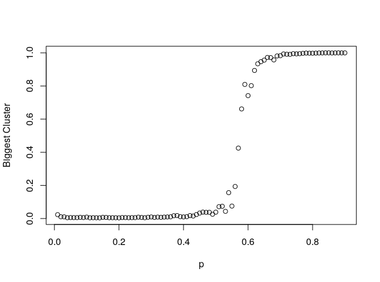
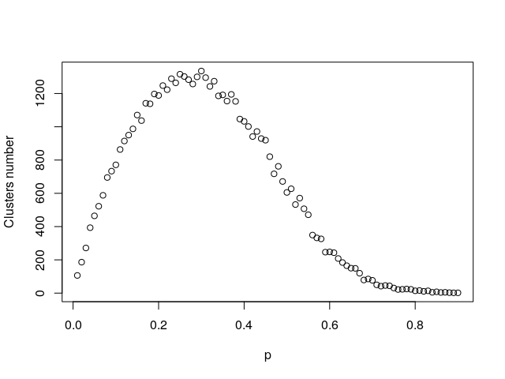

# RandomClustering

Generate a binary (0,1) lattice of size <a href="https://www.codecogs.com/eqnedit.php?latex=n\times&space;n" target="_blank"></a> with parameter p, p indicates how many ones will be placed randomly with respect to the total lattice cells, this will gerate clusters of diferent sizes in the lattice.

### We follow the next steps:
* Create a binary lattice of size <a href="https://www.codecogs.com/eqnedit.php?latex=n\times&space;n" target="_blank"></a> with a probability of filling <a href="https://www.codecogs.com/eqnedit.php?latex=p" target="_blank"></a>.

* Label the clusters that are generated in the lattice.

* Choose the biggets cluster formed in the lattice and randomly remove a cell.

* Choose the smallest clusters and add randomly a cell with the same label of the selected cluster in one of his neighbors.

* If there are several smallest clusters with the same size, we choose one of them randomly and we repeat the previous step.  


## Installation

``` r
# The development version from GitHub:
# install.packages("devtools")
devtools::install_github("FrankBaut/RandomClustering")
```
``` r
# install.packages("tidyverse")
# install.packages("magrittr")
```
## Examples

``` r
# Basic workflow:
library("tidyverse")
library("magrittr")
library("RandomClustering")

Label_clusters <- clusters_matrix(n=100, p = 0.5) %>%
  big_cl() %>% small_cl()
```
Maybe we would like observe the new clusters configuration after one iteration and re-label this configuration. Basically we must do:
``` r
Label_clusters <- clusters_matrix(n=100,p=0.5)
proceso(Label_clusters)
```
Or with pipe operator ``` %>% ```:

``` r
Label_clusters <- clusters_matrix(n=10,p=0.5) %>% proceso()
```

## Simulation

In the given case if you want to make a simulation and observe the biggets cluster in different p values, you can do this:

``` r
n<-100
iterations<-50 
prob_vec<-seq(.01,.9,.01)
biggets_cluster<-matrix(,nrow = length(prob_vec),ncol = iterations)
for (i in 1:length(prob_vec)) {
  data<-clusters_matrix(n,prob_vec[i])
  for (j in 1:iterations) {
    data<-proceso(data)
    caso<-data %>% as.vector()%>% na.omit() %>% plyr::count()
    biggets_cluster[i,j]<-max(caso$freq,na.rm = T)/sum(caso$freq,na.rm = T)
  }
}
```
However this is really slow, therefore we must do a parallel process. Two libraries very useful are ```foreach``` 
and ```doParallel```.
``` r
# install.packages("foreach")
# install.packages("doParallel")
```
``` r
library(foreach)
library(doParallel)
library(RandomClustering)
iterations<-50
n<-100
prob_vec<-seq(.01,.9,.01)
#------------Progress bar------------------
l<-length(prob_vec)
pb <- txtProgressBar(0,l, style = 3)
#------------------------------------------
registerDoParallel(detectCores()-2)
biggets_cluster<-unlist(complete_processPar(n, prob_vec,iterations,l,pb))
stopImplicitCluster()
df<-data.frame(prob_vec,biggets_cluster)
plot(df,xlab="p",ylab="Biggest Cluster")

```



We can choose how many cores we want to use in ```registerDoParallel```  argument. we recommend using at most ```detectCores()-1``` cores. Remenber stop the parallel process with ```stopImplicitCluster()``` when you finish your calculations.


If we want see how many clusters there are after several iterations we must do:
``` r
library(foreach)
library(doParallel)
library(RandomClustering)
iterations<-50
n<-100
prob_vec<-seq(.01,.9,.01)
#------------Progress bar------------------
l<-length(prob_vec)
pb <- txtProgressBar(0,l, style = 3)
#------------------------------------------
registerDoParallel(detectCores()-2)
biggets_cluster<-unlist(complete_clusterNumberPar(n, prob_vec,iterations,l,pb))
stopImplicitCluster()
df<-data.frame(prob_vec,biggets_cluster)
plot(df,xlab="p",ylab="Clusters number")
```


Please cite this work with:

``` r
citation("RandomClustering")
```
or in bibtex format
``` r
toBibtex(citation("RandomClustering"))
```
