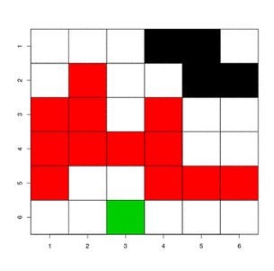

# RandomClustering

We generate a binary lattice of size <a href="https://www.codecogs.com/eqnedit.php?latex=n\times&space;n" target="_blank"></a>, this will gerate clusters of diferent sizes in the lattice.

### We follow the next steps:
* Create a binary lattice of size <a href="https://www.codecogs.com/eqnedit.php?latex=n\times&space;n" target="_blank"></a> with a probability of filling <a href="https://www.codecogs.com/eqnedit.php?latex=p" target="_blank"></a>.

* Label the clusters that are generated in the lattice.

* Choose the biggets cluster formed in the lattice and randomly remove a cell.

* Choose the smallest cluster and we paste rabdomly  a cell with the same label of the selected cluster.

* If there are several smallest clusters with the same size, we choose one of them randomly and we repeat the previous step.  




## Installation

``` r
# The development version from GitHub:
# install.packages("devtools")
devtools::install_github("FrankBaut/RandomClustering")
```
``` r
# install.packages("tidyverse")
# install.packages("magrittr")
```

``` r
# Basic workflow:
library("tidyverse")
library("magrittr")
library("RandomClustering")

Label_clusters <- clusters_matrix(n=10, p = 0.5) %>%
  big_cl() %>% small_cl()
```
``` r
> matrix
      [,1] [,2] [,3] [,4] [,5] [,6] [,7] [,8] [,9] [,10]
 [1,]   NA    1   NA   NA    2   NA   NA   NA    2     2
 [2,]   NA    3   NA   NA    2   NA   NA   NA   NA    NA
 [3,]   NA    3   NA    4   NA    5   NA    6   NA     7
 [4,]   NA   NA   NA    4    4   NA   NA   NA    8    NA
 [5,]    9   NA   NA    4    4    4    4    4   NA     9
 [6,]   NA   NA   NA    4    4    4   NA   NA    9     9
 [7,]   NA    2    2   NA    4    4   NA   10   NA     9
 [8,]    2    2   NA   NA   NA   NA   10   10   NA    NA
 [9,]    2    2   NA   11   NA    2   NA   NA   NA     2
[10,]   NA   NA   12   NA    2    2    2   NA    2     2
attr(,"psd")
 [1]  1 18  1 13  1  1  1  1  5  3  1  1
attr(,"percolation")
[1] TRUE
```
